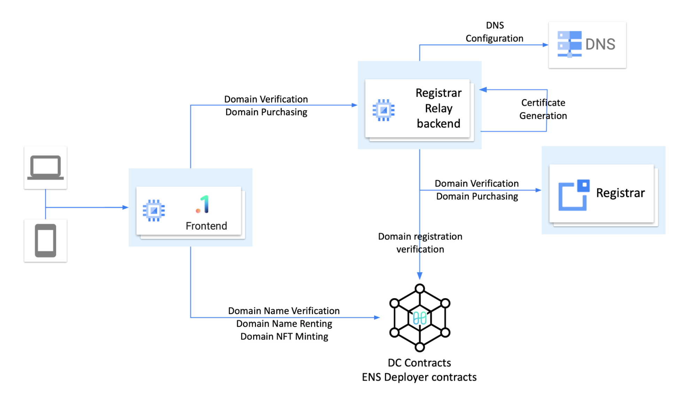

# ENS Overview (30 minutes)

1. Design Document Review (10 minutes)
2. Repository Structure Review (5 minutes)
3. Repository Review (15 minutes)

TODO

- Document DNS IP management process
- Document frontend integration (web site creation)
- Document SSL certificate provisioning (see [gcp-certs.js](https://github.com/harmony-one/ens-registrar-relay/blob/main/src/gcp-certs.js))

## History

| Key Package | Description | Related Docs |
| --- | --- | --- |
| `ens-deployer` | Full beta-version ENS deployment for .country domains, using custom ens-deployer for contracts, v3 frontend, and a variety of indexers and backend services |  See [ENS Notes](../notes/ens-notes.md) |
| D1DC | Experimental radical market implementation for subdomain profile under .1.country | [.1.country](https://github.com/harmony-one/.1.country) |
| DC | Unifying web2 and web3 domain ownership and registration process for .country domains | [dot-country](https://github.com/harmony-one/dot-country) |
| `coredns-1ns` | Using blockchain to manage DNS record for .country domains | See [CoreDNS 1NS notes](../notes/coredns-1ns.md) |
| EAS | Email Alias Services - allows configuration of email addresses on .country domains that forwards to personal email addresses, and potentially to send emails | See [EAS](../notes/eas.md) and [future work](../notes/eas-future-work.md) |
| EWS | Embedded Web Service - allows .country domains and subdomains to be connected to Notion pages, Substack sites, and potentially any other existing website | See [EWS repository](https://github.com/harmony-one/dot-country-embedder) |

## Repositories

Production:

- <https://github.com/harmony-one/ens-deployer>
- <https://github.com/harmony-one/dot-country>
- <https://github.com/harmony-one/ens-registrar-relay>
- <https://github.com/harmony-one/eas>
- <https://github.com/harmony-one/dot-country-embedder>
- <https://github.com/harmony-one/coredns-redis>
- <https://github.com/harmony-one/nft-images-generator>
- <https://github.com/harmony-one/dot-country-manager>
- <https://github.com/harmony-one/one-redirect>

Production, under maintenance by others:

- <https://github.com/harmony-one/1-country.frontend>
- <https://github.com/harmony-one/mux-uploader.backend>

Under review:

- <https://github.com/harmony-one/coredns-1ns>
- <https://github.com/harmony-one/go-1ns>

Others:

- No longer active: <https://github.com/harmony-one/.1.country>
- Deprecated: <https://github.com/harmony-one/ens-app-v3>
- Deprecated: <https://github.com/harmony-one/ens-avatar-worker>
- Deprecated: <https://github.com/harmony-one/ens-metadata-service>
- Deprecated: <https://github.com/harmony-one/ens-subgraph>

### Development Process

Following is an overview of the current development process.

1. Create a branch for the work being done - if you need permission to push to the branch, please create a GitHub issue or contact the repository's main contributor.
2. Complete development and testing under that branch
3. Create a pull request from your branch to the repository main branch (not the fork-origin's main branch, which is selected by default)
6. Wait for the pull request to be reviewed. 
7. Revise based on review feedback, until the pull request is merged.

### Registration Flow

### Other Videos

- Using Docker for deploying ENS backend, indexer, and contracts out-of-the-box in a container: <https://www.youtube.com/watch?v=PObyJV0pWkw>
- End-to-end working demo of ens-app-v3 frontend, and all component used (video link to be added)

